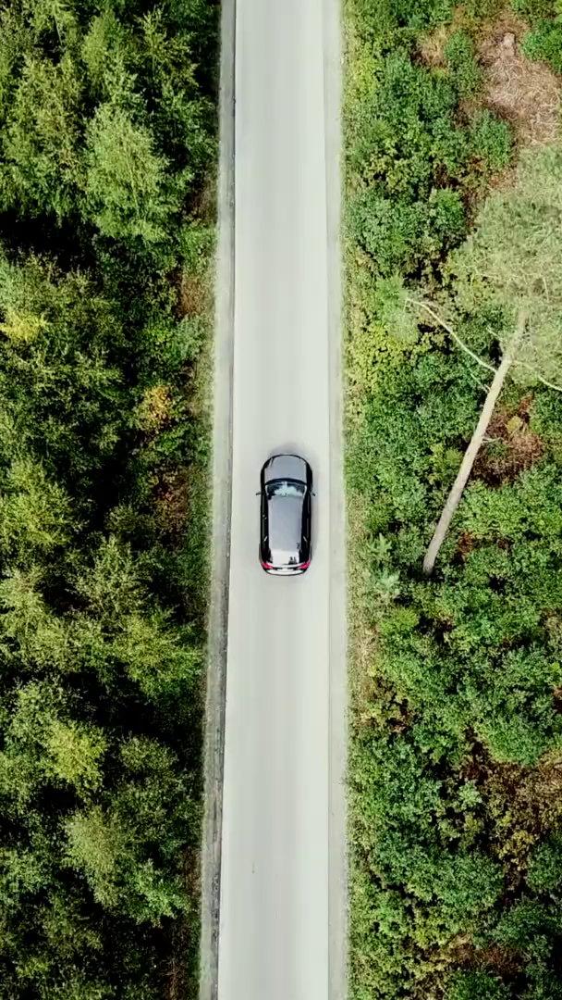
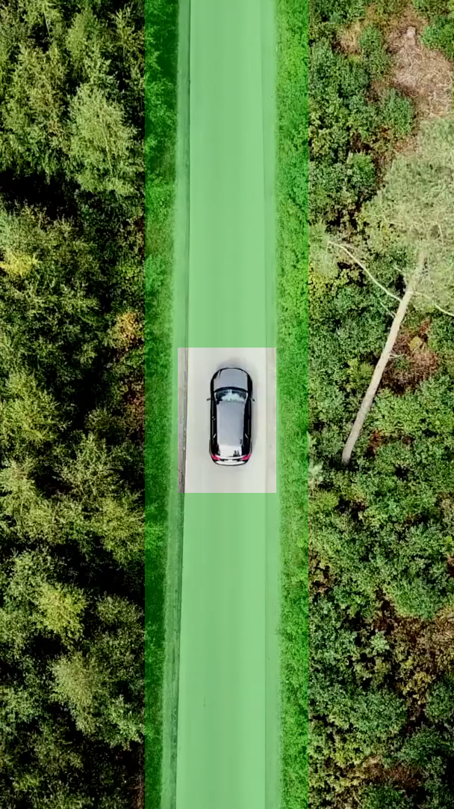
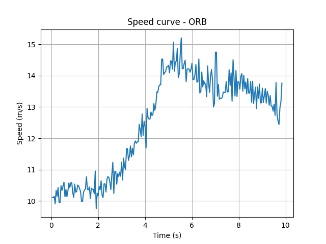
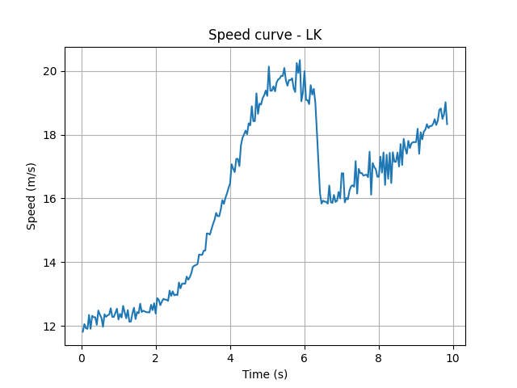

# Visual Speed Estimator – for Drone Videos

## 📌 Abstract
This project explores estimation of a drone’s horizontal speed over time from monocular camera video, using classical visual motion techniques under explicit geometric assumptions.

**Keywords:** computer vision

## ✨ Demo 
https://youtube.com/shorts/kukdQUH4aqU
---

## Main Challenge: Converting Pixel Displacement to Real-World Speed

The core challenge in this project is converting inter-frame pixel displacement observed in the image plane into a physically meaningful speed expressed in real-world units (meters per second).

A monocular camera does not directly provide metric scale. Apparent pixel motion depends on camera geometry, scene depth, and perspective effects. To obtain a usable speed estimate, the system relies on explicit geometric assumptions, including a fixed camera configuration, a dominant ground plane, and a known camera height.

---

# Pipeline Overview

The system is implemented as a sequential processing pipeline that estimates horizontal speed from a monocular video stream under a fixed camera configuration. The pipeline operates on a frame-by-frame basis and consists of the following steps:

## 1. Video Initialization
The input video is loaded using OpenCV. Frame rate and image resolution are extracted and used as part of the timing and geometric conversion process.

- **FPS = 24**
- **Frame size = 608x1024**

## 2. Camera Geometry Setup
Camera intrinsics are approximated from the image resolution and the known horizontal field of view (HFOV). These parameters are used to relate pixel displacement in the image plane to angular motion.

The following parameters must be configured to match the camera setup and recording conditions of the input video:

1. **HFOV_DEG = 80 degrees**  
  Horizontal field of view camera in degrees.
  Used to approximate camera intrinsics from the image resolution.  

2. **HEIGHT_M = 30 meters**  
  Approximate camera height above the ground plane in meters.  
  Used to convert angular motion into horizontal ground displacement.

3. **Intrinsics:**   
    Given:
   - image width w (pixels)
   - image high h (pixels)
   - horizontal field of view HFOV_DEG (degrees)  
     The horizontal focal length in pixel units is computed as:  
     -   fx = (w/ tan(HFOV_DEG)) (pixels)  
     for the pipeline we assume focal length x = focal length y --> fx = fy.  

These parameters define the geometric scale of the scene.   
Incorrect values will directly affect the magnitude of the estimated speed.

## 3. Preprocessing and Region of Interest (ROI)
Each frame is converted to grayscale and masked using a predefined region of interest. The ROI limits motion estimation to relevant ground regions and suppresses background areas that could introduce noise or parallax artifacts.

  <figure style="display:inline-block; width:40%; text-align:center;">
    
    <figcaption>Original video frame 0</figcaption>
  </figure>

  <figure style="display:inline-block; width:40%; text-align:center;">
    
    <figcaption>ROI mask overlay applied to the frame </figcaption>
  </figure>

## 4. Visual Motion Estimation
Inter-frame motion is estimated using one of two classical approaches:

- **A. Lucas–Kanade (LK) Optical Flow**  
  Tracks feature points across frames and estimates average local pixel displacement.

- **B. ORB Feature Matching with RANSAC**  
  Detects and matches features between frames and estimates a dominant rigid motion model while rejecting outliers.

Both estimators produce per-frame pixel displacement measurements along with estimator-specific diagnostic information.  

**Speed Calculation:**
1. Speed = (ground displacement) / FPS.
2. Pixel displacement → angular displacement
    θx = dx_px/ fx  
    θy = dy_px / fy  

    Note:  
   - in LK return many points --> we use median.   
   - in ORB, RANSAC return translation matrix.    
3. Angular displacement → ground displacement  
    dx_m = height_m * (dx_px / fx)  
    dy_m = height_m * (dy_px / fy)  

    Note - ground-plane assumption:
    - motion is mostly horizontal
    - features lie on or near the ground
    - camera height is approximately constant

4. 2D ground displacement magnitude  
    dist_m = sqrt(dx_m² + dy_m²)  
5. Distance per frame → speed  
    speed = dist_m * FPS.

Works well when:
- inter-frame motion is small
- camera height is roughly constant
- scene is dominated by a planar ground
- camera rotation is limited
- scale errors are acceptable

Breaks down when:
- strong parallax (non-ground features dominate)
- large camera rotations
- rapidly changing altitude
- large field-of-view distortion near image edges

# 📊 Result Logging
For each frame, the pipeline records timing information, pixel displacement, estimated speed, and estimator diagnostics into a CSV file. This output is used for offline analysis and visualization.

### CSV Preview – ORB + RANSAC (first 11 rows)

| frame_idx | t_sec | ok | dx_px | dy_px | speed_mps | inlier_ratio | num_matches | inliers |
|---------:|------:|---:|------:|------:|----------:|-------------:|------------:|--------:|
| 0 | 0.000000000 | 0 | 0.000000000 | 0.000000000 | 0.000000000 |  |  |  |
| 1 | 0.041708333 | 1 | -0.548250454 | 5.064896852 | 10.11436208 | 0.941818182 | 1650 | 1554 |
| 2 | 0.083416667 | 1 | -0.690208472 | 5.042366884 | 10.10424272 | 0.950159744 | 1565 | 1487 |
| 3 | 0.125125000 | 1 | -0.442741479 | 5.092394059 | 10.14835339 | 0.948434622 | 1629 | 1545 |
| 4 | 0.166833333 | 1 | -0.654385198 | 4.946282155 | 9.905697758 | 0.942752741 | 1642 | 1548 |
| 5 | 0.208541667 | 1 | -0.424278041 | 5.191802961 | 10.34193769 | 0.935380678 | 1563 | 1462 |
| 6 | 0.250250000 | 1 | -0.563158496 | 5.078847212 | 10.14511734 | 0.947463768 | 1656 | 1569 |
| 7 | 0.291958333 | 1 | -0.540398066 | 5.223495200 | 10.42584685 | 0.944203348 | 1613 | 1523 |
| 8 | 0.333666667 | 1 | -0.481744413 | 4.989340062 | 9.951682611 | 0.961859356 | 1678 | 1614 |
| 9 | 0.375375000 | 1 | 0.000000000 | 0.000000000 | 9.951682611 | 1.000000000 | 2000 | 2000 |
|10 | 0.417083333 | 1 | -0.564389969 | 5.252996480 | 10.48908962 | 0.932530120 | 1660 | 1548 |

### CSV Preview – LK Optical Flow (first 11 rows)

| frame_idx | t_sec | ok | dx_px | dy_px | speed_mps | num_tracks |
|---------:|------:|---:|------:|------:|----------:|-----------:|
| 0 | 0.000000000 | 0 | 0.000000000 | 0.000000000 | 0.000000000 |  |
| 1 | 0.041708333 | 1 | 0.165496826 | 5.951171875 | 11.81976179 | 836 |
| 2 | 0.083416667 | 1 | 0.037033081 | 6.073669434 | 12.05861944 | 831 |
| 3 | 0.125125000 | 1 | 0.127212524 | 6.007904053 | 11.93050121 | 826 |
| 4 | 0.166833333 | 1 | 0.048629761 | 5.998748779 | 11.91004247 | 820 |
| 5 | 0.208541667 | 1 | 0.053909302 | 6.219055176 | 12.34750161 | 817 |
| 6 | 0.250250000 | 1 | 0.019439697 | 6.000457764 | 11.91310660 | 811 |
| 7 | 0.291958333 | 1 | 0.076889038 | 6.204101563 | 12.31829538 | 806 |
| 8 | 0.333666667 | 1 | 0.006378174 | 6.182189941 | 12.27385366 | 801 |
| 9 | 0.375375000 | 1 | 0.000000000 | 0.000000000 | 12.27385366 | 801 |
|10 | 0.417083333 | 1 | 0.051971436 | 6.064025879 | 12.03969156 | 799 |

### **Note:**
- The whole file is available in the output folder.
- Frame 0 contains no valid motion estimate.
- Frame 9 shows zero inter-frame displacement due to identical consecutive frames.

# 📈 Speed curve Comparison
Pixel displacement is converted to an estimated horizontal ground displacement using the camera geometry assumptions and known camera height. Combined with frame timing, this yields an estimated speed for each frame interval.

  <figure style="display:inline-block; width:40%; text-align:center;">
    

  </figure>

  <figure style="display:inline-block; width:40%; text-align:center;">
    

  </figure>

# ⛔ Limitations
- Metric scale depends on assumed camera height and HFOV.
- Rotation can be detected as motion.
- The approach assumes a fixed camera configuration and a dominant ground plane.
- The approach assumes the same brightness level in frames.
- Monocular vision cannot uniquely resolve scale under general 3D motion.
- Duplicate or held frames in video streams can lead to zero inter-frame displacements.
- LK and ORB estimators measure different motion proxies and may yield different speed magnitudes.

These limitations are explicitly exposed rather than heuristically corrected, allowing downstream analysis or application-specific policies to be applied as needed.

